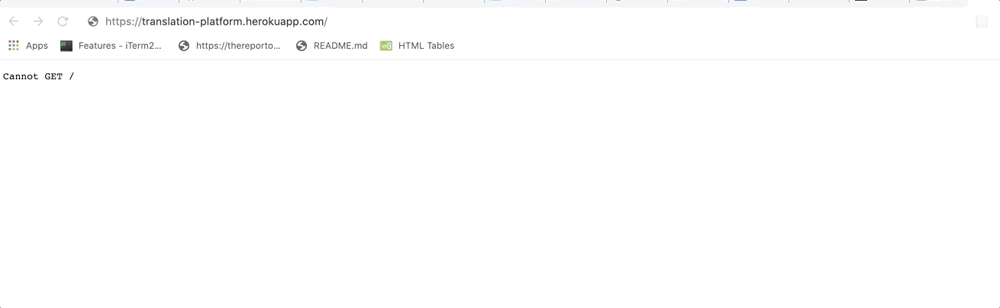

## :black_nib: Tone of Choice :black_nib:

### About the app 

:eyes: [You can find the deployed version of this project here](https://naughty-lumiere-bdfc94.netlify.app/) :eyes:

If you want to try it out, check out [installments and demo's on the client side](https://github.com/DVE91/translator-platform-client).

Sometimes you need a translation that takes into account specific culture references, or needs to convey a certain sentiment to its reader.
To avoid embarrassing mistakes, you need someone that can transcreate, not just translate, communications aligned with your brand. 

Tone of Choice is a translation booking platform that celebrate :sparkles: artists of transcreation. :sparkles:
It provides a quick and easy order system for translations, and a nice dashboard with interesting features for translators associated to the platform.

### Table of contents

:ballot_box_with_check: [Endpoints](#endpoints)

:ballot_box_with_check: [Demo](#demo)

:ballot_box_with_check: [Technologies](#technologies)

:ballot_box_with_check: [Goals and DB models](#goals-and-database-models)

:ballot_box_with_check: [Client repo](#client-repo)

#### Endpoints
Endpoints are divided into three categories:
1. Authorised (e.g. login, sign-up)
2. Translation order (e.g. all languages, suitable translator profiles)
3. User (e.g. personal finances, personal availability)

#### Demo

#### Technologies
Click to see project examples!

:round_pushpin: [Express](https://github.com/DVE91/translator-platform-server/blob/development/index.js)

:round_pushpin: [Sequelize](https://github.com/DVE91/translator-platform-server/tree/development/models)

:round_pushpin: [bcrypt](https://github.com/DVE91/translator-platform-server/blob/development/routers/auth.js)

:round_pushpin: [JSONwebtoken](https://github.com/DVE91/translator-platform-server/blob/development/auth/jwt.js)

### Goals and database models 

#### Goals :pencil2:
This project drew its inspiration from a friend, who works as a freelance translator and has a true passion for language.
As a freelancer, she manages her work in two ways:
1. Through a large known translation platform => high traffic, mostly anonymous, "who writes it" is not a priority.
2. Through her personal website => low traffic, very personal, clients seek her for her work and style.

Her experience with both of these media, led to the following userstories.
The goal was to make a platform that is "best of both worlds". Make it easy for a client to book a translation, 
put the translator back in the spotlights where they belong. 

#### Database model :pencil2:

An ULM for this project is made with DB Diagram and can be found [here](https://dbdiagram.io/d/5f15af5574ca2227330d9588).

#### Client repo

[Click here](https://github.com/DVE91/translator-platform-client) to view the client side of this project.

